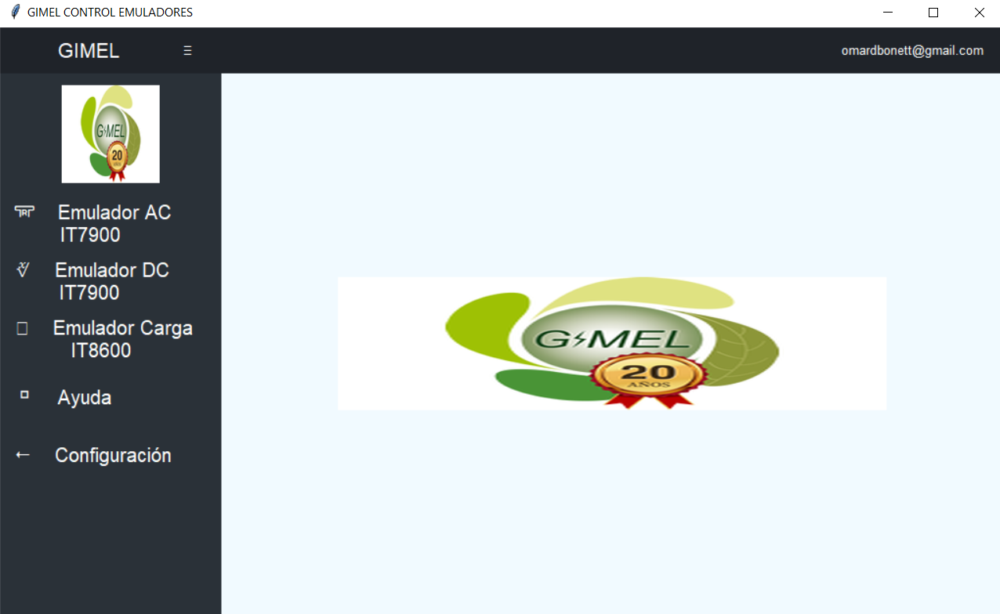
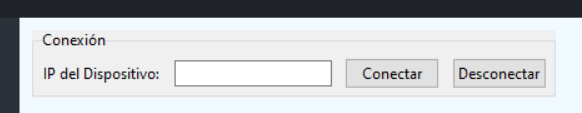
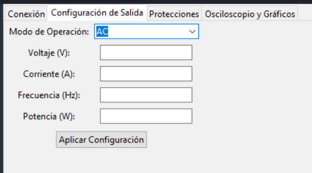
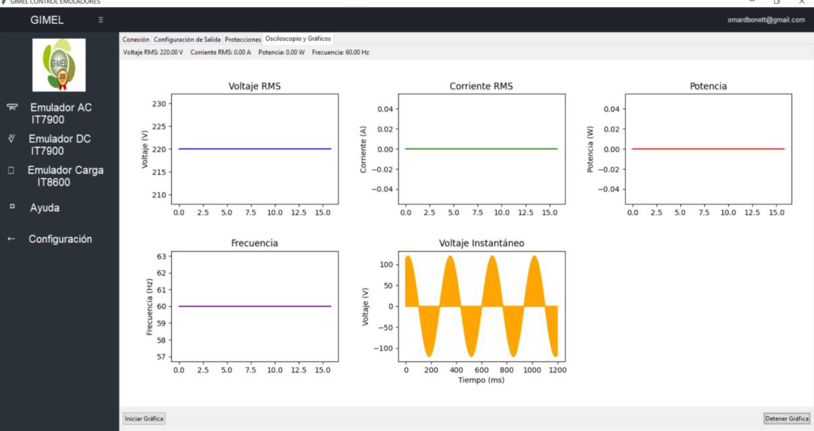
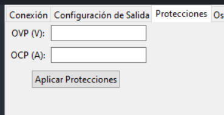

# Manual Técnico del Sistema de Automatización y Monitoreo de Equipos de Laboratorio GIMEL

El siguiente manual corresponde al desarrollo un sistema de automatización y monitoreo en tiempo real para equipos de laboratorio utilizando comandos SCPI y PyVISA. El sistema permite configurar y operar dispositivos como los emuladores IT8615L, IT6000C e IT7900 a través de una interfaz gráfica de usuario (GUI) intuitiva.

## **Características del Proyecto**

### **1. Funcionalidades Principales**
- **Control Remoto:** Configuración de parámetros como voltaje, corriente, potencia y frecuencia desde una GUI.
- **Monitoreo en Tiempo Real:** Visualización gráfica de variables críticas, como el voltaje instantáneo.
- **Protecciones:** Configuración de límites de sobrevoltaje (OVP) y sobrecorriente (OCP).
- **Compatibilidad con Múltiples Dispositivos:** Control simultáneo de los equipos IT8615L, IT6000C e IT7900.

### **2. Tecnología Utilizada**
- **Lenguaje de Programación:** Python
- **Librerías:** PyVISA, Matplotlib, Tkinter
- **Protocolos de Comunicación:** SCPI y VISA
- **Hardware Compatible:** IT8615L, IT6000C, IT7900

---

## **1. Configuración de la Red LAN**

Se configuró una red utilizando el estándar IEEE 802.3ab para Gigabit Ethernet, logrando velocidades de hasta 1 Gbps sobre cables UTP categoría 5, según ANSI/TIA-568A, con capacidad para distancias de hasta 100 metros sin pérdida significativa de señal. El switch Alcatel OmniSwitch 6250-P24 fue ajustado mediante CLI para gestionar eficientemente el tráfico de datos, implementando VLAN y asignando direcciones IP estáticas según su manual técnico.

### **1.1. Descripción de las Direcciones IP Asignadas**
Cada instrumento se encuentra configurado con una dirección IP única dentro del segmento de red **192.168.0.x/24**, para garantizar una comunicación adecuada:

- **IT7909-350-90 (Fuente AC):** 192.168.0.100
- **IT6000C (Fuente DC):** 192.168.0.101
- **IT8615L (Emuladores de Carga):**
  - Dispositivo 1: 192.168.0.102
  - Dispositivo 2: 192.168.0.103
  - Dispositivo 3: 192.168.0.104


### **1.2. Configuración de las Interfaces de Red y puerto**

---

### **1.2.1 Configuración de Conexión LAN y Puerto para Socket en el IT6000C**

#### Requisitos Previos
- Asegúrate de que el equipo esté conectado a una red Ethernet funcional.
- Conecta el dispositivo a la red a través del puerto LAN de la parte trasera.
- Verifica que el dispositivo esté apagado antes de realizar cualquier conexión.

#### 1. Acceder al Menú de Configuración de Red
1. Enciende el dispositivo.
2. Presiona la combinación de teclas `[Shift]` + `[P-set]` para entrar al menú de configuración del sistema.

#### 2. Configurar la Interfaz LAN
1. Navega en el menú hasta la opción **LAN** y presiona `[Enter]`.
2. Selecciona **IP-Conf** para configurar los parámetros de red:
   - **IP Mode**:
     - `Auto`: Para asignación automática mediante DHCP.
     - `Manual`: Para configuración manual.
   - **IP**: Introduce la dirección IP deseada (por ejemplo, `192.168.0.100`).
   - **Mask**: Introduce la máscara de subred (por ejemplo, `255.255.255.0`).
   - **Gateway**: Introduce la puerta de enlace (por ejemplo, `192.168.0.1`).
3. Configura valores adicionales si es necesario:
   - **DNS1**: Dirección del servidor DNS preferido.
   - **DNS2**: Dirección del servidor DNS alternativo.
4. Configura el **Socket Port**: Introduce el puerto de comunicación deseado (por defecto, `30000`).

#### 3. Guardar los Cambios
1. Presiona `[Enter]` para guardar cada configuración.
2. Usa `[Esc]` para regresar al menú principal.

#### 4. Probar la Conexión
1. Conecta un dispositivo (como una computadora) en la misma red.
2. Realiza un **ping** al dispositivo utilizando la dirección IP configurada para verificar la conexión.
3. Si configuraste un puerto socket, asegúrate de que el software cliente pueda comunicarse a través del puerto especificado.

---

### **1.2.2 Configuración de Conexión LAN y Puerto para Socket en el IT7900**


#### Requisitos previos
- Conecta el equipo IT7900 a una red mediante el puerto LAN en el panel trasero.
- Asegúrate de que el dispositivo esté apagado antes de realizar cualquier conexión.

#### 1. Acceder al menú de configuración de comunicación
1. Enciende el dispositivo.
2. Presiona `[Shift]` + `[System]` en el panel frontal para acceder al menú del sistema.
3. Usa los botones de navegación o la pantalla táctil para seleccionar la opción **Set the communication interface**.

#### 2. Configurar la interfaz LAN
1. En el menú **LAN Interface**, configura los parámetros necesarios:
   - **IP Mode**:
     - `DHCP`: Asignación automática de dirección IP.
     - `Manual`: Configuración manual de la IP.
   - **IP Address**: Introduce la dirección IP deseada, por ejemplo, `192.168.0.100`.
   - **Subnet Mask**: Especifica la máscara de subred, por ejemplo, `255.255.255.0`.
   - **Gateway**: Configura la puerta de enlace, por ejemplo, `192.168.0.1`.
   - **Socket Port**: Define el puerto de comunicación, por ejemplo, `8080`.


#### 3. Activar y configurar servicios LAN
1. En el mismo menú, habilita los servicios de comunicación necesarios:
   - **RAW Socket**: Habilita la comunicación directa mediante sockets.
   - **Ping**: Activa la función de ping para probar la conectividad.
   - **Telnet-SCPI**: Permite comandos remotos a través de Telnet.


#### 4. Guardar los cambios
1. Una vez configurados los parámetros, presiona `[Enter]` para guardar los cambios.
2. Usa `[Esc]` para regresar al menú principal.


#### 5. Probar la conexión
1. Desde una computadora en la misma red, realiza un **ping** a la dirección IP configurada para confirmar la conectividad.
2. Si configuraste un puerto socket, utiliza software cliente (como PuTTY o Python) para conectarte al puerto y verificar la comunicación.

---

### **1.2.3 Configuración de Conexión LAN y Puerto para Socket en el IT8600**

#### Requisitos previos
- Conecta el equipo IT7900 a una red mediante el puerto LAN en el panel trasero.
- Asegúrate de que el dispositivo esté apagado antes de realizar cualquier conexión.

#### 1. Acceder al menú de configuración
1. Enciende el dispositivo.
2. Presiona el botón `[Menu]` en el panel frontal para acceder al menú principal.

#### 2. Configuración de la interfaz LAN
1. En el menú, selecciona **COMM CONFIG** (Configuración de comunicación) y presiona `[Enter]`.
2. Navega a la opción **LAN** y presiona `[Enter]`.
3. Configura los siguientes parámetros:
   - **IP Mode**:
     - `DHCP`: Para asignación automática de dirección IP.
     - `MANUAL`: Para configuración manual de la IP.
   - **IP Address**: Introduce la dirección IP deseada (por ejemplo, `192.168.0.100`).
   - **Subnet Mask**: Introduce la máscara de subred (por ejemplo, `255.255.255.0`).
   - **Gateway**: Configura la puerta de enlace (por ejemplo, `192.168.0.1`).
   - **Socket Port**: Define el puerto de comunicación (por ejemplo, `8080`).

#### 3. Guardar los cambios
1. Presiona `[Enter]` para guardar cada configuración.
2. Usa `[Esc]` para regresar al menú principal.

#### 4. Verificar la conectividad
1. Conecta un dispositivo en la misma red y realiza un **ping** a la dirección IP configurada.
2. Si configuraste un puerto socket, utiliza un cliente de pruebas como PuTTY o una herramienta de programación (por ejemplo, Python) para verificar la conexión al puerto.

---

### **1.3 Configuración del Switch**

#### Configuración de Red en Topología Estrella con VLAN en Alcatel OS6250/6450

Este segmento describe el proceso paso a paso para configurar una red en topología estrella utilizando VLAN en un switch Alcatel OS6250/6450.

#### Requisitos Previos

1. Un switch Alcatel OS6250/6450.
2. Software de terminal como PuTTY o Tera Term.
3. Credenciales de acceso al switch.
4. Conexión física entre los dispositivos y el switch.

### Pasos para la Configuración

#### 1. Conexión y Acceso al Switch

1. Conecta un cable de consola entre tu computadora y el puerto de consola del switch.
2. Configura la conexión en el software de terminal:
   - Velocidad: **9600 baudios**.
   - Datos: **8 bits**.
   - Paridad: **ninguna**.
   - Bit de parada: **1 bit**.
3. Accede al CLI del switch con las credenciales correspondientes.

#### 2. Configuración de los Puertos

1. Identifica los puertos a utilizar para los dispositivos finales y el puerto troncal.
2. Habilita los puertos:
   ```
   interface ethernet <puerto>
   no shutdown
   ```
3. Verifica el estado de los puertos:
   ```
   show interfaces status
   ```

#### 3. Creación de VLANs

1. Define las VLANs necesarias:
   ```
   vlan <ID_VLAN>
   name <nombre_VLAN>
   exit
   ```
2. Repite este paso para cada VLAN requerida.

#### 4. Asignación de Puertos a las VLANs

- **Modo acceso** (dispositivos finales):
  ```
  interface ethernet <puerto>
  vlan pvid <ID_VLAN>
  exit
  ```
- **Modo troncal** (hacia otro switch o router):
  ```
  interface ethernet <puerto_troncal>
  vlan trunk enable
  vlan trunk allowed <ID_VLAN_1>,<ID_VLAN_2>,...
  exit
  ```

#### 5. Habilitación de Etiquetado 802.1Q

Asegúrate de que el etiquetado de VLAN esté habilitado en los puertos troncales:
``` 
interface ethernet <puerto_troncal>
 vlan tagging enable
 exit
```

#### 6. Configuración de VLAN de Administración (Opcional)

1. Crea una VLAN para administración:
   ```
   vlan <ID_VLAN_ADMIN>
   name ADMIN
   exit
   ```
2. Asigna una dirección IP al switch dentro de esta VLAN:
   ```
   interface vlan <ID_VLAN_ADMIN>
   ip address <IP_ADMIN> <MASCARA>
   exit
   ```

#### 7. Verificación de la Configuración

1. Confirma las VLAN creadas:
   ```
   show vlan
   ```
2. Verifica las interfaces asignadas:
   ```
   show interfaces vlan
   ```
3. Revisa la configuración en ejecución:
   ```
   show running-config
   ```

#### 8. Guardar la Configuración

Para evitar la pérdida de configuración tras un reinicio, guarda los cambios:
``` 
write memory
```

#### 9. Pruebas Finales

1. Conecta los dispositivos finales y verifica la conectividad dentro de cada VLAN.
2. Prueba la conectividad entre las VLAN y el gateway configurado.

#### Notas

- Consulta la documentación oficial del switch para obtener más detalles sobre comandos avanzados.

---

# 2. Configuración del software

Este documento describe la estructura del software desarrollado para la automatización y monitoreo en tiempo real de los equipos de laboratorio IT8615L, IT6000C e IT7900.

El software está diseñado en **Python** y se basa en la comunicación con los equipos mediante **SCPI y PyVISA**. Permite:
- **Configurar** los dispositivos de forma remota.
- **Monitorear en tiempo real** parámetros como voltaje y corriente.
- **Administrar protecciones** (OVP y OCP).
- **Visualizar gráficas interactivas**.

## **2.1 Requisitos del Sistema**

### **2.1.1 Hardware Requerido**
- Computadora con Python instalado.
- Equipos de laboratorio compatibles con SCPI.
- Red LAN establecida para la comunicación con los dispositivos.

### **2.2.2 Software Necesario**
- Python 3.8 o superior
- Controladores VISA (NI-VISA, Keysight VISA, etc.).

---

## **2.2 Estructura del Proyecto**

La estructura del software está organizada en módulos para facilitar la escalabilidad y mantenimiento.

📂 Proyecto
│── 📂 controllers
│    │── IT8615LController.py 
│    │── IT6000CController.py 
│    │── IT7900Controller.py 
│── 📂 ui 
│    │── main_ui.py 
│── 📂 utils 
│    │── helpers.py 
│── main.py
│── README.md
│── requirements.txt

- controllers/ → Contiene las clases de control de cada equipo.
- ui/ → Maneja la interfaz gráfica y la interacción del usuario.
- utils/ → Funciones auxiliares, manejo de errores y utilidades.
- main.py → Punto de entrada del sistema.

---

## **2.3 API de Controladores**

Cada equipo cuenta con una clase que encapsula la comunicación SCPI mediante PyVISA.

### **2.3.1 Clase base de controlador**

La clase base implementa la librería PyVISA para facilitar la comunicación con instrumentos de medición y prueba que utilizan el estándar VISA (Virtual Instrument Software Architecture). Su propósito principal es proporcionar una interfaz unificada para el envío de comandos SCPI y la recepción de datos desde dispositivos conectados a través de interfaces TCP/IP

 ```python
import pyvisa

class InstrumentController:
    def __init__(self, ip, port=8080):
        self.rm = pyvisa.ResourceManager()
        self.resource = f"TCPIP::{ip}::{port}::SOCKET"
        self.device = None

    def connect(self):
        """Establece conexión con el dispositivo."""
        try:
            self.device = self.rm.open_resource(self.resource)
            self.device.timeout = 5000
            print("Conectado con éxito.")
        except Exception as e:
            print(f"Error en la conexión: {e}")

    def send_command(self, command):
        """Envía un comando SCPI al dispositivo."""
        self.device.write(command)

    def query(self, command):
        """Solicita un valor al dispositivo."""
        return self.device.query(command)
 ```

#### Características de la Clase Base

1. Gestión de Conexión
   - Establece y gestiona la comunicación con los dispositivos.
   - Configura el tiempo de espera y los terminadores adecuados.
2. Envío de Comandos SCPI
   - roporciona métodos para enviar comandos de configuración y control.
3. Recepción de Datos
   - Permite realizar consultas SCPI para obtener mediciones o estados de los equipos.
4. Compatibilidad con Diversos Instrumentos
   - Funciona con cualquier equipo compatible con SCPI y VISA sin importar el fabricante.

### **2.3.1 Implementación para un Dispositivor**

Para cada clase que controla un dispositivo, se heredó de la clase base InstrumentController, lo que permitió reutilizar la lógica de conexión y comunicación a través de PyVISA. Luego, se configuraron los métodos específicos de cada equipo para adaptar la interacción a sus comandos SCPI particulares.

#### Herencia de la Clase Base y Métodos Personalizados

Herencia de la Clase Base y Métodos Personalizados.

```python
class IT8615LController(InstrumentController):
    """Controlador para el emulador de carga IT8615L."""
    
    def set_load_mode(self, mode="CC"):
        """Configura el modo de carga: CC (Corriente Constante), CR (Resistencia Constante), CP (Potencia Constante)."""
        self.send_command(f"FUNC {mode}")

    def set_current(self, current):
        """Configura la corriente de carga."""
        self.send_command(f"CURR {current}")

    def measure_voltage(self):
        """Obtiene el voltaje medido en la carga."""
        return self.query("MEAS:VOLT?")

    def measure_current(self):
        """Obtiene la corriente medida en la carga."""
        return self.query("MEAS:CURR?")

```
#### Ejemplo de uso de clase hija para el controlador de carga IT816L

```python
it8615 = IT8615LController("192.168.0.101")
it8615.connect()
it8615.set_load_mode("CC")
it8615.set_current(5)
voltage = it8615.measure_voltage()
print(f"Voltaje medido: {voltage} V")
it8615.disconnect()

```

---

## **2.4 Interfaz de Usuario (UI)**

La interfaz gráfica de usuario (GUI) fue desarrollada con Tkinter para facilitar la configuración, monitoreo y control de los equipos de laboratorio en tiempo real. Su diseño modular permite una navegación intuitiva a través de pestañas, agrupando las principales funcionalidades del sistema.

### **Funcionalidades de la UI**

La UI está organizada en 3 pestañas principales, cada una con funcionalidades específicas de los equipos del sistema.



para cada equipo se tienen las siguientes configuraciones:

1. Conexión con los Equipos

   - Permite ingresar la dirección IP de los dispositivos y establecer comunicación.
   - Verifica la conectividad con el equipo antes de permitir configuraciones adicionales.

   

2. Configuración de Parámetros

   - Ajuste de voltaje, corriente y frecuencia para cada dispositivo.
   - Posibilidad de seleccionar el modo de operación en equipos compatibles.
   - Aplicación de los parámetros de configuración mediante comandos SCPI.

   

3. Monitoreo en Tiempo Real
   
   - Visualización gráfica de los valores de voltaje y corriente en tiempo real.
   - Osciloscopio virtual para la captura y análisis de señales.

   

4. Gestión de Protecciones

   - Configuración de límites de seguridad como OVP (Over Voltage Protection) y OCP (Over Current Protection).
   - Notificaciones sobre eventos críticos en la interfaz.

   

--- 

## **2.5 Instalación**

### **2.5.1. Clonar el repositorio**

Abra una terminal y ejecute:
```bash
git clone https://github.com/davito19/Automatizacion_GIMEL_con_SCPIyVISA.git
cd Automatizacion_GIMEL_con_SCPIyVISA
```

### **2.5.2 Crear un entorno virtual**

Es recomendable utilizar un entorno virtual para gestionar las dependencias del proyecto.
```bash
python3 -m venv env
source env/bin/activate  # En Windows, use 'env\Scripts\activate'
```

### **2.5.3. Instalar dependencias**
Las dependencias necesarias están listadas en el archivo `requirements.txt`.
```bash
pip install -r requirements.txt
```

---

## **2.6 Configuración**

### **2.6.1. Configuración de PyVISA**
Asegúrese de que los controladores necesarios para la comunicación con los equipos de laboratorio estén instalados.  
PyVISA es una biblioteca que permite la comunicación con instrumentos a través de interfaces como GPIB, USB y Ethernet.  
Puede encontrar más información y guías de instalación en la [documentación oficial de PyVISA](https://pyvisa.readthedocs.io/).

### **2.6.2. Archivos de configuración**
Revise si el proyecto incluye archivos de configuración específicos (por ejemplo, archivos `.ini` o `.json`) que deban ser ajustados según su entorno o los equipos que utilizará.  
Consulte la documentación del proyecto o los comentarios en el código para obtener detalles sobre cómo configurar estos archivos.

---

## **2.7 Uso**

### **2.7.1. Ejecutar la aplicación**

Una vez completada la instalación y configuración, puede ejecutar la aplicación principal.  
Según la estructura del proyecto, el archivo principal podría ser `main.py`.
```bash
python main.py
```

además, para ejecutar tu script con un comando en cualquier ubicación, puedes hacer lo siguiente:


1. Crea un archivo con extensión `.bat` en una carpeta accesible (por ejemplo, `C:\Scripts\mi_comando.bat`).
2. Dentro del archivo, escribe lo siguiente:

   ```bat
   @echo off
   python "C:\Scripts\mi_script.py" %*
   ```

### **2.7.2. Interfaz de usuario**

La UI está diseñada para proporcionar una **interacción intuitiva** con los dispositivos de laboratorio, permitiendo:
- **Conexión remota** a los equipos.
- **Configuración de parámetros operativos** (voltaje, corriente, frecuencia).
- **Monitoreo en tiempo real** mediante gráficos interactivos.
- **Gestión de protecciones** para prevenir daños en los dispositivos.

#### Nagación por la UI

La interfaz está dividida en cuatro secciones principales, accesibles mediante pestañas en la parte superior.

##### Conexión con los Equipos

Ubicación: Pestaña **"Conexión"**
Esta sección permite establecer comunicación con los dispositivos.

**Pasos**:

1. Ingrese la dirección IP del equipo en el campo correspondiente.
2. Haga clic en el botón "Conectar" para establecer la conexión.
3. Si la conexión es exitosa, se mostrará un mensaje de confirmación.
4. Para desconectar, cierre la aplicación o seleccione "Desconectar".

**Errores Comunes y Soluciones**

| Error | Causa Posible | Solución |
|----------|----------|----------|
| No se puede conectar al dispositivo   | IP incorrecta o dispositivo apagado  | Verifique la IP y que el equipo esté encendido  |
| No responde a comandos	   | Problema en la red  | Asegúrese de que la red LAN funciona correctamente
  |

##### Configuración de Parámetros

Ubicación: Pestaña **"Configuración de salida"**

En esta sección, el usuario puede configurar los parámetros operativos de los dispositivos.

**Pasos**:

1. Seleccione el modo de operación en el menú desplegable (AC, DC, AC+DC).
2. Ingrese los valores deseados en los campos:
   - Voltaje (V)
   - Corriente (A)
   - Frecuencia (Hz)
3. Haga clic en "Aplicar Configuración" para enviar los ajustes al equipo.

**Advertencias**:

- Evite configurar valores que superen los límites de seguridad del equipo.
- Asegúrese de que la conexión esté activa antes de aplicar cambios.

##### Monitoreo en Tiempo Real

Ubicación: Pestaña **"Monitoreo"**

Esta pestaña permite visualizar en gráficos en tiempo real los valores de voltaje y corriente.

**Pasos**:

1. Haga clic en "Iniciar Gráfica" para comenzar a recibir datos en tiempo real.
2. La gráfica se actualizará automáticamente cada 1 ms.
3. Para detener el monitoreo, haga clic en "Detener Gráfica".

**Interpretación del Gráfico**:

- Eje X → Representa el tiempo (milisegundos).
- Eje Y → Muestra el voltaje o corriente en tiempo real.
- Línea Azul → Representa la variación de la medición.
- Puntos Rojos → Indican valores fuera de los límites permitidos.

##### Gestión de Protecciones

Ubicación: Pestaña **"Protecciones"**

En esta sección, el usuario puede configurar límites de seguridad para evitar daños en los dispositivos.

**Pasos**:

1. Ingrese los valores deseados para:
   - Sobrevoltaje (OVP) (Ejemplo: 250V)
   - Sobrecorriente (OCP) (Ejemplo: 10A)
2. Haga clic en "Aplicar Protecciones" para activar las configuraciones de seguridad.
3. Si un parámetro sobrepasa los límites, se generará una alerta visual.

**Advertencias**:

- No deshabilite las protecciones a menos que sea estrictamente necesario.
- Si se genera una alerta, revise la configuración del dispositivo.


## **2.8 Scripts de ejemplo**
El proyecto puede incluir scripts de ejemplo en el directorio `examples`.  
Revise estos scripts para comprender mejor cómo interactuar con los equipos de laboratorio y adaptar el código a sus necesidades específicas.

Para obtener más detalles y actualizaciones, visite el [repositorio oficial del proyecto](https://github.com/davito19/Automatizacion_GIMEL_con_SCPIyVISA).

